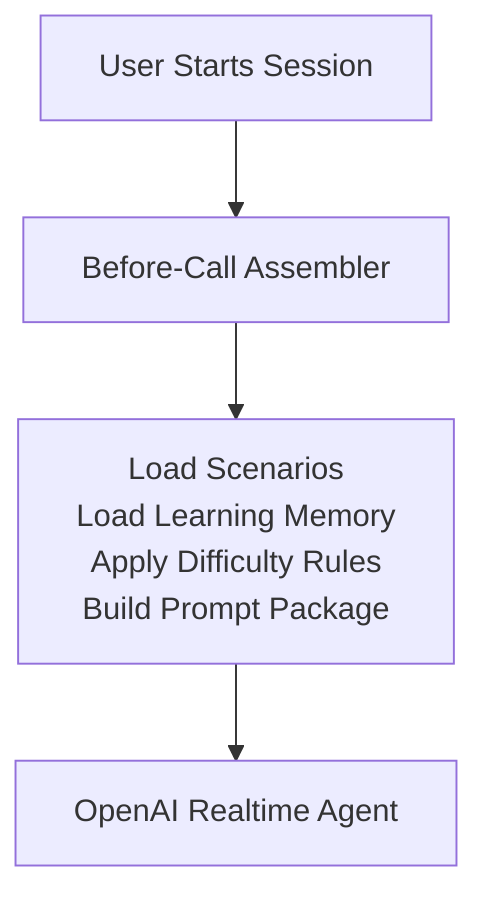

# Before-Call Assembler Architecture

## Purpose
The Before-Call Assembler is responsible for constructing the complete context package that will be sent to the OpenAI Realtime Agent before a training session begins.  

It combines:  
- Scenario configuration
- User learning memory
- Previous session performance
- Difficulty settings  

### High-Level Flow

